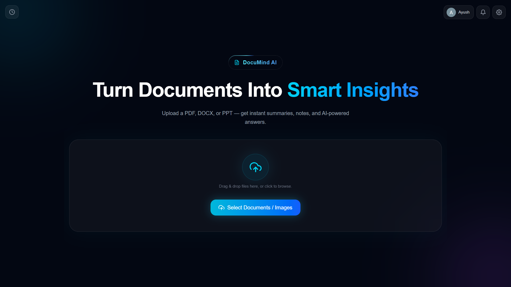
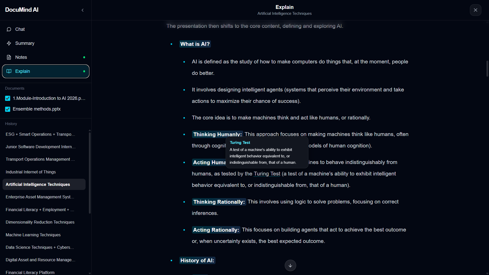
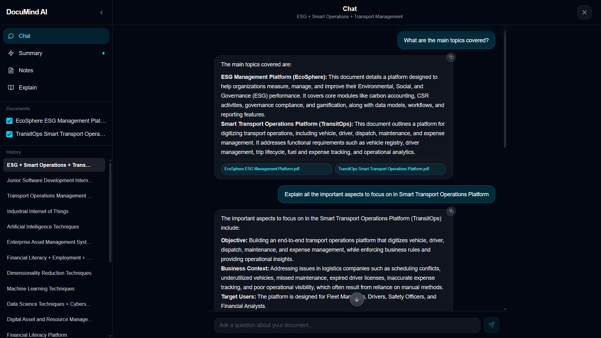
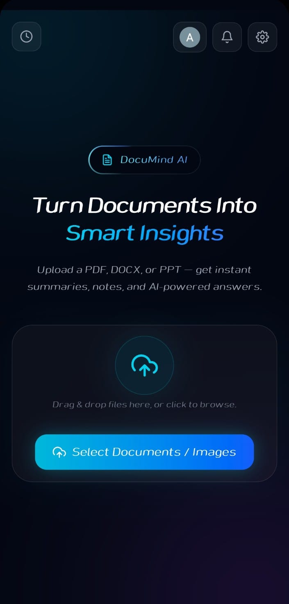

<div align="center">

# 📄 DocuMind AI

**AI-powered document intelligence — upload, understand, and converse with your documents.**

Upload PDFs, Word docs, PowerPoints, text files, or images and instantly get AI-generated summaries, structured notes, plain-English explanations, and a RAG-powered chat assistant that answers questions grounded strictly in your own content.

[Live Demo](https://documind-ai-brown.vercel.app) · [Report a Bug](https://github.com/AyushBaware/ai-document-assistant/issues) · [Request a Feature](https://github.com/AyushBaware/ai-document-assistant/issues)



</div>

---

## Table of Contents

- [Overview](#overview)
- [Features](#features)
- [Tech Stack](#tech-stack)
- [Architecture](#architecture)
- [Project Structure](#project-structure)
- [Getting Started](#getting-started)
- [Environment Variables](#environment-variables)
- [API Reference](#api-reference)
- [Design Decisions Worth Knowing](#design-decisions-worth-knowing)
- [Known Limitations](#known-limitations)
- [Roadmap](#roadmap)
- [Contributing](#contributing)
- [License](#license)

---

## Overview

DocuMind AI is a full-stack MERN application built to go beyond simple "upload and summarize" tools. It combines fast document processing with a proper **Retrieval-Augmented Generation (RAG)** pipeline, so users can not only generate summaries/notes/explanations but also **have a grounded conversation** with their documents — with citations, semantic search, and zero hallucinated answers outside the source material.

It supports both anonymous, single-session use and full account-based history via Google OAuth, with a persistent session sidebar modeled after Claude/Gemini's own chat interfaces.

This project was built as a hands-on learning project to go deep on RAG, vector search, and production-grade engineering patterns (caching, deduplication, rate limiting, graceful degradation) — not just wire together an API call.

---

## Features

### 📥 Document Ingestion
- Multi-file upload (drag-and-drop or file picker) — PDF, DOC/DOCX, PPT/PPTX, TXT, PNG/JPG/WEBP
- Text extraction per format:
  - PDF: table-aware extraction (text grouped by row position, not just concatenated)
  - DOCX: via Mammoth
  - PPTX: via officeparser (slide text, not just titles)
  - Images: OCR via Tesseract.js
- Automatic low-text-density detection (flags scanned/image-heavy documents so the AI never silently guesses at content it couldn't read)
- Auto-generated human-readable display names extracted directly from document content (zero extra API cost)

### 🧠 AI Content Generation
Three content-adaptive generation modes (not fixed templates — structure adapts to what the document actually is):
- **Summary** — key points, structured per document type (resume, report, paper, deck, etc.)
- **Notes** — revision-ready, heavily bulleted, bolded key terms
- **Explain** — a full walkthrough for someone encountering the material for the first time

Powered by **Gemini 2.5 Flash**, with:
- Dynamic token budgeting (fixed ceilings + a content-length-aware floor, so long dense documents are never cut off)
- Head + tail trimming for oversized documents (preserves both opening context and conclusion)
- Targeted retry logic for truncated or empty responses
- **Inline glossary** — Gemini appends a JSON glossary of the hardest terms in the same call (zero extra requests); the UI renders them as hover tooltips on desktop and tap-to-toggle popups on mobile
- **Document scoping** — for multi-file uploads, checkboxes let you generate a Summary/Notes/Explain from only a chosen subset of documents; each subset's result is cached and restored independently



### 💬 RAG-Based "Ask Questions" Chat
- Full semantic search pipeline: chunking → embedding → MongoDB Atlas Vector Search → top-k retrieval
- Answers are grounded **only** in retrieved document chunks — the model is instructed to refuse rather than guess when context is insufficient
- Prompt-injection guardrails (document content is always treated as data, never as instructions)
- Source citations shown per answer
- Full-screen chat overlay with desktop sidebar + mobile hamburger nav, styled after Claude/Gemini's interface
- In-session answer caching (identical repeated questions cost zero extra tokens)
- Balanced per-document retrieval for multi-document sessions — runs one vector search per selected document instead of a single global top-k, so no document gets silently starved out of the answer
- Graceful degradation messaging if embeddings failed at upload time (transient Gemini overload), instead of a confusing "no answer found"



### 🗂️ Session History & Persistence (for signed-in users)
- Every upload batch is saved as a "session" — documents + generated responses + full chat history
- Reopening a session costs **zero API calls** to review past work
- Session titles are auto-generated using a spread-sampling technique (head + middle + tail of the document) via Groq's free-tier `llama-3.1-8b-instant`; multi-document uploads get one combined title — a shared theme if the files are related, or a `TopicA + TopicB + TopicC` breakdown if they're not — with a silent fallback to a filename-based title if Groq is unavailable or slow
- Rolling 20-session limit per user (oldest sessions auto-pruned)
- Embeddings are deduplicated by content hash — re-uploading an identical file reuses existing vectors instead of re-embedding

### 🔐 Authentication
- Google OAuth (Sign in with Google) — fully optional; the app works anonymously too
- Custom JWT issued after Google verification (7-day expiry)
- Self-healing auth: an expired/invalid token automatically clears itself and drops the user back to a logged-out state instead of silently failing
- User-supplied Gemini API keys are encrypted server-side (AES-256-GCM) and tied to an anonymous device cookie, never `localStorage`
- Anonymous users get 5 lifetime free requests, enforced against **both** the device cookie and IP address (so clearing cookies alone can't reset the cap); signing in removes it entirely
- An anonymous session (documents, chat, and generated Summary/Notes/Explain) auto-restores after a refresh and can be saved permanently on login
- **Shared-key security alerts** — if the same Gemini API key gets registered on a different device/account, the original owner receives an in-app notification (device/browser context only — never the other identity) so they can rotate a possibly-leaked key

### 🎨 UI/UX
- Full-screen chat experience benchmarked against Claude and Gemini's own interfaces
- Framer Motion animations, scoped intentionally (message entrance, mode crossfade — no decorative motion)
- Responsive design, mobile-first bug-fixing priority
- Global minimal scrollbar styling, scroll-fade blur overlays
- Always-visible copy-to-clipboard on chat bubbles and generated responses
- **Installable PWA** — manifest + Workbox service worker, works as a standalone app on mobile/desktop, with an in-app prompt when a new version is available
- Mobile-specific navigation: hamburger menu with mode switching + per-document checkboxes, replacing the desktop sidebar on small screens


d
### 🔔 Notifications & Alerts
- In-app notification bell (signed-in users only) — currently used for security alerts when your saved Gemini key is detected on another device/account
- Desktop: full message inline; mobile: compact swipeable list (swipe to delete, tap for detail)
- Rolling cap of 3 notifications per user — oldest are auto-pruned

---

## Tech Stack

| Layer | Technology |
|---|---|
| Frontend | React 19, Vite, Tailwind CSS v4, Framer Motion, React Router |
| Backend | Node.js, Express 5, Mongoose |
| Database | MongoDB Atlas (+ Atlas Vector Search) |
| AI — Generation | Google Gemini 2.5 Flash |
| AI — Embeddings | Gemini `gemini-embedding-001` (768 dimensions) |
| AI — Session Titles | Groq (`llama-3.1-8b-instant`, free tier) |
| Auth | Google OAuth 2.0 + custom JWT |
| Text Extraction | pdfjs-dist, mammoth, officeparser, tesseract.js |
| Security | Helmet, express-rate-limit, CORS allowlisting |
| PWA | vite-plugin-pwa (Workbox service worker, installable manifest) |

---

## Architecture

```
                       ┌──────────────────────┐
                       │   React (Vite) SPA   │
                       │  Tailwind + Framer    │
                       └──────────┬───────────┘
                                  │ REST (axios)
                       ┌──────────▼───────────┐
                       │   Express API Layer   │
                       │ (auth / upload / ai / │
                       │      sessions)        │
                       └──────────┬───────────┘
                 ┌────────────────┼────────────────┐
                 │                │                │
        ┌────────▼───────┐ ┌──────▼──────┐  ┌──────▼───────┐
        │  Gemini 2.5     │ │   MongoDB   │  │     Groq      │
        │  Flash (gen)    │ │   Atlas +   │  │ (session      │
        │  + Embeddings   │ │   Vector    │  │  titles only) │
        │                 │ │   Search    │  │               │
        └─────────────────┘ └─────────────┘  └───────────────┘
```

**Two document-reading paths, by design:**
- **Fresh upload** → served from an in-memory `knowledgeStore` (fast, no DB round-trip needed for a first-time Summary/Notes/Explain)
- **Reopened session** → served directly from MongoDB (the in-memory store is gone after a server restart/new upload — sessions never depend on it)

**RAG pipeline:** documents are chunked (6,000 chars, 200-char overlap) → embedded via Gemini `gemini-embedding-001` (768-dim) → stored in MongoDB with a 24-hour TTL for anonymous/unsaved uploads → promoted to permanent once a session is saved → retrieved via `$vectorSearch` scoped to the relevant document/session.

---

## Project Structure

```
ai-document-assistant/
├── client/
│   └── src/
│       ├── api/            # axios wrappers per feature (auth, upload, ai, chat, sessions)
│       ├── components/     # UI components (+ upload/ subfolder for the upload flow)
│       ├── constants/       # shared constants (AI modes, nav items, accepted file types)
│       ├── context/         # AuthContext
│       ├── hooks/           # useFileUpload, useSessionLoader, useAIGeneration, useDesktopSessions
│       └── utils/           # small pure helpers (file icons, etc.)
│
└── server/
    ├── controllers/         # aiController, authController, chatController, sessionController, uploadController
    ├── middleware/          # auth (required/optional), upload (multer + validation)
    ├── models/              # User, Session, DocumentChunk
    ├── routes/
    └── utils/               # extraction, chunking, embeddings, retrieval, title generation
```

---

## Getting Started

### Prerequisites
- Node.js 18+
- A MongoDB Atlas cluster (with a Vector Search index named `vector_index` on the `DocumentChunk.embedding` field, 768 dimensions)
- A Google Gemini API key ([aistudio.google.com](https://aistudio.google.com/apikey))
- A Google OAuth Client ID ([console.cloud.google.com](https://console.cloud.google.com))
- (Optional) A free Groq API key for smart session titles

### Clone the repository

```bash
git clone https://github.com/AyushBaware/ai-document-assistant.git
cd ai-document-assistant
```

### Backend setup

```bash
cd server
npm install
```

Create `server/.env`:

```env
PORT=5000
MONGO_URI=your_mongodb_connection_string
GEMINI_API_KEY=your_gemini_api_key
GOOGLE_CLIENT_ID=your_google_oauth_client_id
JWT_SECRET=a_long_random_secret_string
CLIENT_URL=http://localhost:5173
GROQ_API_KEY=your_groq_api_key   # optional — smart titles fall back gracefully without it
```

```bash
npm run dev
```

Runs on `http://localhost:5000`.

### Frontend setup

```bash
cd client
npm install
```

Create `client/.env`:

```env
VITE_API_BASE_URL=http://localhost:5000/api
VITE_GOOGLE_CLIENT_ID=your_google_oauth_client_id
```

```bash
npm run dev
```

Runs on `http://localhost:5173`.

> Note: users can also paste their own Gemini API key directly in the app (BYOK) — it's encrypted and stored server-side, tied to an anonymous device cookie (not `localStorage`), so it works before login too. Anonymous use is capped at 5 lifetime requests; signing in removes that cap and links the key to the account. If no user key is provided, the server falls back to its own `GEMINI_API_KEY`.

---

## Environment Variables

| Variable | Location | Required | Description |
|---|---|---|---|
| `MONGO_URI` | server | ✅ | MongoDB Atlas connection string |
| `GEMINI_API_KEY` | server | ✅ | Fallback Gemini key if a user hasn't supplied their own |
| `GOOGLE_CLIENT_ID` | server + client | ✅ | Google OAuth client ID |
| `JWT_SECRET` | server | ✅ | Signs the app's own session JWTs |
| `CLIENT_URL` | server | ✅ | Allowed CORS origin (your deployed frontend URL) |
| `GROQ_API_KEY` | server | ⬜ | Enables AI-generated session titles; silently skipped if absent |
| `API_KEY_ENCRYPTION_SECRET` | server | ✅ | Encrypts user-supplied Gemini API keys at rest (AES-256-GCM) |
| `VITE_API_BASE_URL` | client | ✅ | Backend API base URL |
| `VITE_GOOGLE_CLIENT_ID` | client | ✅ | Google OAuth client ID (frontend) |

---

## API Reference

All routes are prefixed with `/api`.

| Method | Route | Auth | Description |
|---|---|---|---|
| `POST` | `/upload` | optional | Upload + extract + embed documents |
| `POST` | `/ai/generate` | optional | Summary/Notes/Explain for a fresh upload |
| `POST` | `/ai/generate-from-session` | required | Summary/Notes/Explain for a saved session |
| `POST` | `/ai/chat` | optional | RAG chat for a fresh upload |
| `POST` | `/ai/chat-from-session` | required | RAG chat for a saved session (persists history) |
| `POST` | `/auth/google` | — | Verify Google ID token, issue app JWT |
| `GET` | `/auth/me` | required | Get current user from JWT |
| `POST` | `/sessions` | required | Save a new session |
| `GET` | `/sessions` | required | List current user's sessions |
| `GET` | `/sessions/:id` | required | Get full session detail |
| `PATCH` | `/sessions/:id` | required | Save a generated response into a session |
| `DELETE` | `/sessions/:id` | required | Delete a session |
| `POST` | `/apikey` | optional | Save/encrypt the caller's Gemini API key |
| `GET` | `/apikey/status` | optional | Check if a key exists + remaining guest requests |
| `POST` | `/guest-session` | optional | Save in-progress anonymous work (documents, chat, cached results) |
| `GET` | `/guest-session` | optional | Restore in-progress anonymous work |
| `DELETE` | `/guest-session` | optional | Discard in-progress anonymous work |
| `POST` | `/guest-session/convert` | required | Convert a pending guest session into a permanent saved session on login |
| `GET` | `/notifications` | required | List current user's notifications |
| `PATCH` | `/notifications/:id/read` | required | Mark a notification as read |
| `DELETE` | `/notifications/:id` | required | Delete a notification |

The `/api/ai/*` routes are rate-limited (20 requests / 5 minutes / IP) to protect the Gemini quota from abuse.

---

## Design Decisions Worth Knowing

A few non-obvious choices, documented for anyone reading the codebase:

- **Two AI-generation code paths (fresh upload vs. saved session)** exist because the in-memory `knowledgeStore` used for a fresh upload doesn't survive a server restart or a different upload batch. Reopened sessions read `extractedText` directly from MongoDB instead.
- **Chat retrieves chunks, not full documents** — Summary/Notes/Explain intentionally send the whole document to Gemini (they need the full picture), while chat only sends the top-k semantically relevant chunks, since a single question rarely needs the entire document and this is significantly cheaper per exchange.
- **Content-hash deduplication** on embeddings — re-uploading an identical file skips a redundant Gemini embedding call entirely.
- **Session titles are generated once, then locked** (`titleSource: "default" | "groq" | "fallback"`) — reopening a session never re-rolls or re-spends quota on its title.
- **`gemini-embedding-001` at 768 dimensions** — Google deprecated `text-embedding-004` on Jan 14, 2026; this project already migrated, with `outputDimensionality` explicitly pinned since Atlas vector indexes can't be resized after creation.

---

## Known Limitations

- Text extraction does not perform OCR on images/charts embedded *inside* PDFs or PPTX files (only standalone image uploads get OCR). Low-text-density documents are flagged so the AI is transparent about this gap instead of guessing.
- The in-memory `knowledgeStore` used for fresh uploads is per-process — this works correctly for a single-server deployment but would need to move to Redis (or MongoDB) before scaling behind a load balancer with multiple instances.
- Anonymous (not-logged-in) work is kept temporarily (24 hours) so it survives a refresh, and can be converted into a permanent saved session upon login — but it is not retained indefinitely the way a logged-in session is.

---

## Roadmap

**Recently completed:**
- [x] Session title display in the full-screen chat header (desktop + mobile)
- [x] Balanced multi-document retrieval in chat (per-document vector search instead of one global top-k)
- [x] Deployed live on Vercel
- [x] Global error boundary for graceful failure recovery
- [x] Installable PWA with offline-aware caching and update prompts

**Still planned:**
- [ ] **Flashcards generator** — auto-generate spaced-repetition-style flashcards from a document
- [ ] **Quiz generator** — auto-generate multiple-choice/short-answer quizzes with answer keys
- [ ] **"Important Questions"** — likely-exam-question generation for revision
- [ ] Streaming AI responses instead of a single blocking response
- [ ] Exportable summaries/notes (PDF/Markdown download)
- [ ] True page-number citation tracking (requires extraction/chunking pipeline changes)
- [ ] Refine multi-file Groq titles to a cleaner "Primary Topic +N more" format
- [ ] Automated test coverage (unit + integration)

---

## Contributing

This is currently a solo learning project, but issues, suggestions, and pull requests are welcome. If you spot a bug or have an idea, please open an issue first to discuss what you'd like to change.

1. Fork the repo
2. Create a feature branch (`git checkout -b feature/your-feature`)
3. Commit your changes
4. Open a pull request

---

## License

This project is licensed under the [MIT License](LICENSE) — free to use, modify, and learn from.

---

<div align="center">

Built by [Ayush Baware](https://github.com/AyushBaware) as a hands-on project to learn production-grade RAG architecture, from an MCA student's perspective.

</div>
